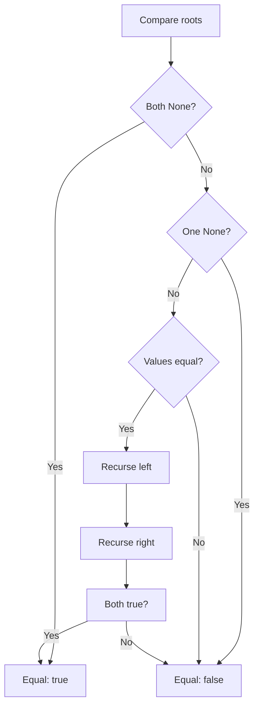

# Compare Tree Diagrams

Mermaid diagram for a step-by-step guide for how the equality check works.

## Topical questions

### What is recursion and why use this here?

**Recursion** means a function calls itself (directly or indirectly) to solve a smaller instance of the same problem. Here, two trees are equal if:

1. The root values are equal, and  
2. The left subtrees are equal, and  
3. The right subtrees are equal.

“Are the left/right subtrees equal?” is the same problem as “are two trees equal?”, so we recurse. We stop when both sides are `None` (same empty structure), or when one is `None` and the other isn’t, or when a value differs. The tree is defined recursively (each node has subtrees), so the algorithm naturally mirrors that structure.

### Why use Box?

Rust requires every type to have a **fixed size at compile time**. If we wrote `left: Option<TreeNode>` and `right: Option<TreeNode>`, then `TreeNode` would contain two `TreeNode`s, each containing two more… so the type would have **infinite size**, which the compiler does not allow.

`Box<T>` is a pointer to a heap-allocated `T`. The size of `Box<T>` is fixed (one pointer), regardless of how big the tree is. So `Option<Box<TreeNode>>` has a known size: either “no child” or “a pointer to one node”. That breaks the infinite-size cycle and lets us build trees of any depth. Each node also has clear single ownership of its left and right subtrees.
